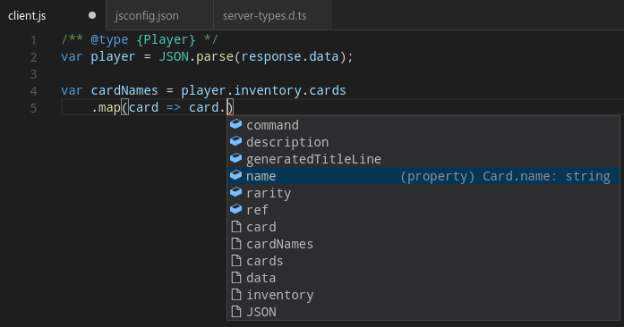

#TypeScript definition generator for the JVM

This library generates TypeScript definitions that cover a set of Kotlin and Java classes using Kotlin reflection.

This is useful when data classes are serialized to JSON and
handled in a JavaScript or TypeScript web frontend.

This library supports:
 * Primitive types, with or without explicit int.
 * Kotlin and Java classes.
 * Data classes.
 * Enums.
 * Any type.
 * Generic classes, without type erasure.
 * Generic constraints.
 * Class inheritance.
 * Abstract classes.
 * Lists as JS arrays.
 * Maps as JS objects.
 * Null safety, even inside composite types.
 * Java beans.
 * Mapping types.
 * Nullability annotations, when allowed by the retention policy.
 * Customizing class definitions via transformers.
 * Parenthesis optimization: They are placed only when they are needed to disambiguate.
 
## Installation

This library requires Kotlin 1.1, which is EAP at time of writing. This library has been tested with 1.1-M04. 

This library cannot work with Kotlin 1.0 as its reflection library is not powerful enough to do this transformation. 

See [this post](https://blog.jetbrains.com/kotlin/2016/12/kotlin-1-1-m04-is-here/) to see how install Kotlin 1.1 EAP.

Then you need to include this library in your project. The easiest way is to [download it from JitPack](https://jitpack.io/#ntrrgc/ts-generator). For instance, in Gradle you would add this to `build.gradle`:

```groovy
repositories {
    maven { url 'https://jitpack.io' }
}

dependencies {
    compile 'com.github.ntrrgc:ts-generator:1.0.0-pre1'
}
```

## Basic usage

First you need is your Kotlin or Java classes or interfaces, for instance:

```kotlin
enum class Rarity(val abbreviation: String) {
    Normal("N"),
    Rare("R"),
    SuperRare("SR"),
}

data class Card(
    val ref: String,
    val rarity: Rarity,
    val name: String,
    val description: String,
    val command: String?,
    val playCard: (() -> Unit)?
) {
    val generatedTitleLine = "*$name* [$rarity]"
}

data class Inventory(
    val cards: List<Card> = listOf()
)

data class Player(
    val name: String,
    val inventory: Inventory = Inventory(),
    val achievementsProgress: List<AchievementCompletionState> = listOf(),
    val notices: List<Notice> = listOf()
)

data class Notice(
    val dateTime: LocalDateTime,
    val text: String
)

data class Achievement(
    val ref: String,
    val title: String,
    val description: String,
    val measuredProperty: (player: Player) -> Int,
    val neededValue: Int
)

data class AchievementCompletionState(
    val achievementRef: String,
    val reachedValue: Int
)
```

Then use `TypeScriptGenerator` to generate the TypeScript definitions, like this:

```kotlin
fun main(args: Array<String>) {
    println(TypeScriptGenerator(
        rootClasses = setOf(
            Player::class
        ),
        mappings = mapOf(
            LocalDateTime::class to "Date",
            LocalDate::class to "Date"
        )
    ).definitionsText)
}
```

You will get an output like this:

```typescript
interface AchievementCompletionState {
    achievementRef: string;
    reachedValue: number;
}

type Rarity = "Normal" | "Rare" | "SuperRare";

interface Card {
    command: string | null;
    description: string;
    generatedTitleLine: string;
    name: string;
    rarity: Rarity;
    ref: string;
}

interface Inventory {
    cards: Card[];
}

interface Notice {
    dateTime: Date;
    text: string;
}

interface Player {
    achievementsProgress: AchievementCompletionState[];
    inventory: Inventory;
    name: string;
    notices: Notice[];
}
```

Then you can paste it into a `.d.ts` file and declare it in your environment, e.g:
 
 * TypeScript: Just add the file to your project.
 * JS with Visual Studio Code: Create a `jsconfig.json` in Visual Code and adding it in the `include` section of `typeAcquisition`. [You can read more about type adquisition in the VS Code documentation.](https://code.visualstudio.com/Docs/languages/javascript#_automatic-type-acquisition)
 * IntelliJ/WebStorm/PHPStorm: Open the Settings and look for *Libraries* inside *JavaScript*. Click *Add* and create a new library declaration adding the created definition file. [Read more about it in the documentation](https://www.jetbrains.com/help/idea/2016.3/configuring-javascript-libraries.html)
  


## Advanced features

This generator can handle more complex data types. Some examples are shown below:

### Mapping types

Sometimes you want to map certain Kotlin or Java classes to native JS types, like `Date`. 

This can be done with the `mappings` argument of `TypeScriptGenerator`, as show in the first example. 

Note the types mapped with this feature are emitted as they were written without any further processing. This is intended to support native JS types not defined in the Kotlin or Java backend.

### Int type

Currently TypeScript only supports one number type: `number`. 

This may change if [a proposal for int types](https://github.com/Microsoft/TypeScript/issues/4639) succeeds. Also, some people may want to be extra explicit and do:

```typescript
type int = number;
```

In order to be able to document if a type may or may not be integer. In any case, you can instruct `TypeScriptGenerator` to use explicit `int` with the `intTypeName` parameter. For instance:
 
```kotlin
fun main(args: Array<String>) {
    println(TypeScriptGenerator(
        rootClasses = setOf(
            AchievementCompletionState::class
        ),
        intTypeName = "int"
    ).definitionsText)
}
```

The output will be:

```typescript
interface AchievementCompletionState {
    achievementRef: string;
    reachedValue: int;
}
```

### Inheritance support

```kotlin
open class BaseClass(val a: Int)

class DerivedClass(val b: List<String>): BaseClass(4)

fun main(args: Array<String>) {
    println(TypeScriptGenerator(
        rootClasses = setOf(
            DerivedClass::class
        )
    ).definitionsText)
}
```

The output is:

```typescript
interface BaseClass {
    a: number;
}

interface DerivedClass extends BaseClass {
    b: string[];
}
```

By default `Serializable` and `Comparable` interfaces are not emitted. You can filter out more interfaces or classes by using the `ignoreSuperclasses` parameter of the `TypeScriptGenerator` constructor.

### Generics

```kotlin
class ContrivedExample<A, out B, out C: List<Any>>(
    private val a: A, 
    val b: B, 
    val c: C,
    val listOfPairs: List<Pair<Int, B>>)
    
fun main(args: Array<String>) {
    println(TypeScriptGenerator(
        rootClasses = setOf(
            ContrivedExample::class
        )
    ).definitionsText)
}
```

The output is:

```typescript
interface Pair<A, B> {
    first: A;
    second: B;
}

interface ContrivedExample<A, B, C extends any[]> {
    b: B;
    c: C;
    listOfPairs: Pair<number, B>[];
}
```

### Maps as JS objects

```kotlin
data class CardRepository(
    val cardsByRef: Map<String, Card>)
```

The output is:

```typescript
type Rarity = "Normal" | "Rare" | "SuperRare";

interface Card {
    command: string | null;
    description: string;
    generatedTitleLine: string;
    name: string;
    rarity: Rarity;
    ref: string;
}

interface CardRepository {
    cardsByRef: { [key: string]: Card };
}
```

### Java beans

Sometimes you want to work with long boring Java classes like this one:

```java
public class JavaClass {
    private String name;
    private int[] results;
    private boolean finished;
    private char[][] multidimensional;

    public String getName() { return name; }
    public void setName(String name) { this.name = name; }

    public int[] getResults() { return results; }
    public void setResults(int[] results) { this.results = results; }

    // setters are not required for this to work!
    public boolean isFinished() { return finished; }

    public char[][] getMultidimensional() { return multidimensional; }
    public void setMultidimensional(char[][] multidimensional) { 
        this.multidimensional = multidimensional; 
    }
}
```

Even though its fields are private, they are accessible through getter methods. The generator knows this, so they are included in the definition:

```typescript
interface JavaClass {
    name: string;
    results: number[];
    multidimensional: string[][];
    finished: boolean;
}
```

### Java nullability annotations

Kotlin was designed with null-safety in mind, but the Java land is not so green.

In Java all types are nullable by default, so the programmer needs some way to annotate which may and which will never be null. There are many ways to do this, each with its own set of drawbacks.

The TypeScript generator makes no effort by itself to infer the nullability of Java types. Nevertheless kotlin-reflect is capable of decoding it if the classes are annotated with JSR305 annotations (`javax.annotation.*`). If no annotations are found, the types are assumed to be not null.

Note that `org.jetbrains.annotations.*` and `android.support.annotation.*` **cannot** work for this purpose, as they don't have [runtime retention](https://docs.oracle.com/javase/8/docs/api/java/lang/annotation/Retention.html) and therefore are stripped by the compiler without leaving a way to read them through reflection.

The following an example of a class with supported annotations:

```java
import javax.annotation.Nullable;
import javax.annotation.ParametersAreNonnullByDefault;

// Add this to Gradle/Maven to get the annotations:
// compile 'com.google.code.findbugs:jsr305:3.0.1'

@ParametersAreNonnullByDefault
public class JavaClassWithNonnullAsDefault {
    private int[] results;

    @Nullable
    private int[] nextResults;

    JavaClassWithNonnullAsDefault(
        int[] results, 
        @Nullable int[] nextResults)
    {
        this.results = results;
        this.nextResults = nextResults;
    }

    public int[] getResults() { return results; }
    public void setResults(int[] results) { this.results = results; }

    @Nullable
    public int[] getNextResults() { return nextResults; }
    public void setNextResults(@Nullable int[] nextResults) {
        this.nextResults = nextResults;
    }
}
```

The output is the following:

```typescript
interface JavaClassWithNonnullAsDefault {
    name: string;
    results: number[];
    nextResults: number[] | null;
}
```

### Transformers

Sometimes they objects you use in TypeScript or JavaScript are not exactly the same you use in your backend, but have some differences, for instance:

* You may transform one type into another.
* Your classes may use camelCase in the backend but being turned into snake_case in the frontend by the JSON serializer.
* Some properties of some classes may be not be sent to the frontend.

To support cases like these, `TypeScriptGenerator` supports class transformers. They are objects implementing the `ClassTransformer` interface, arranged in a pipeline. They can be used to customize the list of properties of a class and their name and type.

Below are some examples:

#### Filtering unwanted properties

In the following example, assume we don't want to emit `ref`:

```kotlin
data class Achievement(
    val ref: String,
    val title: String,
    val description: String,
    val measuredProperty: (player: Player) -> Int,
    val neededValue: Int
)
```

We can use the `transformPropertyList()` to remove it.

```kotlin
fun main(args: Array<String>) {
    println(TypeScriptGenerator(
        rootClasses = setOf(
            Achievement::class
        ),
        classTransformers = listOf(
            object : ClassTransformer {
                override fun transformPropertyList(
                    properties: List<KProperty<*>>,
                    klass: KClass<*>
                ): List<KProperty<*>> {
                    return properties.filter { property ->
                        property.name != "ref"
                    }
                }
            }
        )
    ).definitionsText)
}
```

The output is:

```typescript
interface Achievement {
    description: string;
    neededValue: number;
    title: string;
}
```

#### Renaming to snake_case

You can use `transformPropertyName()` to rename any property.

The functions `camelCaseToSnakeCase()` and `snakeCaseToCamelCase()` are included in this library.

```kotlin
data class AchievementCompletionState(
    val achievementRef: String,
    val reachedValue: Int)

fun main(args: Array<String>) {
    println(TypeScriptGenerator(
        rootClasses = setOf(
            AchievementCompletionState::class
        ),
        classTransformers = listOf(
            object : ClassTransformer {
                override fun transformPropertyName(
                    propertyName: String,
                    property: KProperty<*>,
                    klass: KClass<*>
                ): String {
                    return camelCaseToSnakeCase(propertyName)
                }
            }
        )
    ).definitionsText)
}
```

The output is:

```typescript
interface AchievementCompletionState {
    achievement_ref: string;
    reached_value: number;
}
```

#### Replacing types for some properties

Imagine in our previous example we don't want to emit `achievement_ref` with type `string`, but rather `achievement`, with type `Achievement`. 

We can use a combination of `transformPropertyName()` and `transformPropertyType()` for this purpose:

```typescript
fun main(args: Array<String>) {
    println(TypeScriptGenerator(
        rootClasses = setOf(
            AchievementCompletionState::class
        ),
        classTransformers = listOf(
            object : ClassTransformer {
                override fun transformPropertyName(
                    propertyName: String, 
                    property: KProperty<*>, 
                    klass: KClass<*>
                ): String {
                    if (propertyName == "achievementRef") {
                        return "achievement"
                    } else {
                        return propertyName
                    }
                }

                override fun transformPropertyType(
                    type: KType, 
                    property: KProperty<*>, 
                    klass: KClass<*>
                ): KType {
                    // Note: property is the actual property from the class
                    // (unless replaced in transformPropertyList()), so
                    // it maintains the original property name declared
                    // in the code.
                    if (property.name == "achievementRef") {
                        return Achievement::class.createType(nullable = false)
                    } else {
                        return type
                    }
                }
            }
        )
    ).definitionsText)
}
```

The output is:

```typescript
interface Achievement {
    description: string;
    neededValue: number;
    ref: string;
    title: string;
}

interface AchievementCompletionState {
    achievement: Achievement;
    reachedValue: number;
}
```

Note how `Achievement` class is emitted recursively after the transformation has taken place, even though it was not declared in the original `AchievementCompletionState` class nor specified in `rootClasses`.

### Applying transformers only to some classes

Transformers are applied to all classes by default. If you want your transformers to apply only to classes matching a certain predicate, you can wrap them in an instance of `FilteredClassTransformer`. This is its definition:
 
 ```kotlin
class FilteredClassTransformer(
    val wrappedTransformer: ClassTransformer,
    val filter: (klass: KClass<*>) -> Boolean
): ClassTransformer
```

For the common case of applying a transformer only on a class and its subclasses if any, an extension method is provided, `.onlyOnSubclassesOf()`:
 
```kotlin
fun main(args: Array<String>) {
    println(TypeScriptGenerator(
        rootClasses = setOf(
            Achievement::class
        ),
        classTransformers = listOf(
            object : ClassTransformer {
                override fun transformPropertyList(
                    properties: List<KProperty<*>>,
                    klass: KClass<*>
                ): List<KProperty<*>> {
                    return properties.filter { property ->
                        property.name != "ref"
                    }
                }
            }.onlyOnSubclassesOf(Achievement::class)
        )
    ).definitionsText)
}
```

### Optional\<T\> unwrapping

This is an example of a more complex transformer that can be used to unwrap `Optional<T>` into `T | null`.

Let's suppose a Java class like this:

```java
public class JavaClassWithOptional {
    private String name;
    private String surname;

    public Optional<String> getSurname() {
        return Optional.ofNullable(surname);
    }

    public String getName() {
        return name;
    }
}
```

We could use this transformer:

```kotlin
object : ClassTransformer {
    override fun transformPropertyType(
        type: KType,
        property: KProperty<*>,
        klass: KClass<*>
    ): KType {
        val bean = Introspector.getBeanInfo(klass.java)
            .propertyDescriptors
            .find { it.name == property.name }

        val getterReturnType = bean?.readMethod?.kotlinFunction?.returnType
        if (getterReturnType?.classifier == Optional::class) {
            val wrappedType = getterReturnType.arguments.first().type!!
            return wrappedType.withNullability(true)
        } else {
            return type
        }
    }
}
```

The result would be this:

```typescript
interface JavaClassWithOptional {
    name: string;
    surname: string | null;
}
```

# License

```text
Copyright 2017 Alicia Boya García

Licensed under the Apache License, Version 2.0 (the "License");
you may not use this file except in compliance with the License.
You may obtain a copy of the License at

   http://www.apache.org/licenses/LICENSE-2.0

Unless required by applicable law or agreed to in writing, software
distributed under the License is distributed on an "AS IS" BASIS,
WITHOUT WARRANTIES OR CONDITIONS OF ANY KIND, either express or implied.
See the License for the specific language governing permissions and
limitations under the License.
```